<div align="center">

# Ankit Dimri — Full-Stack Portfolio

**Full-stack software engineer** building fast, reliable web &amp; mobile products with the MERN stack, React Native and machine learning.

[](https://react.dev)
[](https://expressjs.com)
[](https://neon.tech)
[-100%20·%20100%20·%20100%20·%20100-ff6b35)](#performance)
[](LICENSE)

### [🌐 portfolio-nine-orcin-33.vercel.app](https://portfolio-nine-orcin-33.vercel.app/)

<!-- GitHub strips <iframe> from READMEs, so this clickable preview card stands in for an embedded site. -->
<a href="https://portfolio-nine-orcin-33.vercel.app/" title="Open the live portfolio">
  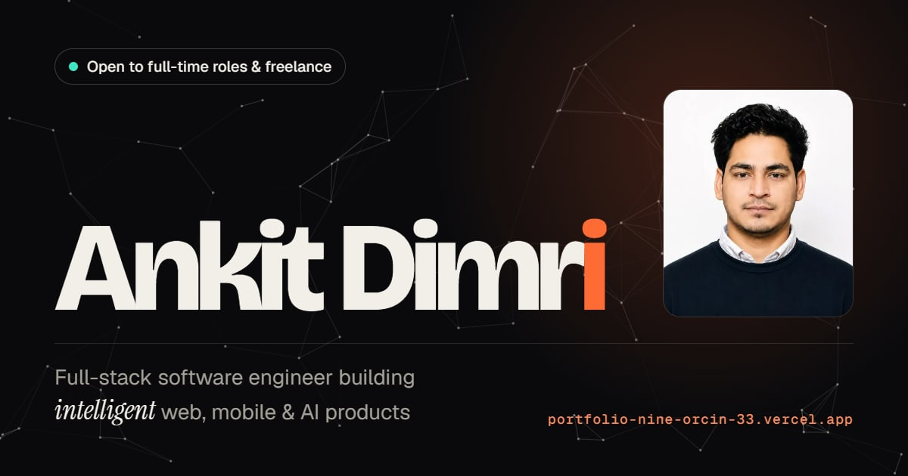
</a>

<sub>Click the preview to open the live site · API on Render: <code>https://portfolio-backend-71xj.onrender.com</code></sub>

</div>

---

## Highlights

- **Immersive, engineer-themed UI** — dark &amp; light themes, a fluid type system and a 12-column layout that uses the full width of laptops and large screens.
- **Hero** — the name decodes from binary (hover it to see the initials *A D* as `01000001 01000100`), a 3D code-editor card with parallax layers, and a node network that reacts to the cursor.
- **Live data** — GitHub commits/repos and LeetCode stats fetched server-side, cached, and shown with a "synced X min ago" indicator.
- **Scroll storytelling** — cards unfold into place, headlines flip up and the tech ribbons react to scroll speed — all compositor-only CSS, with a full reduced-motion fallback.
- **Useful details** — certificate cover-flow with drag + lightbox, in-page interactive map of Dehradun, 12-hour IST clock, one-click email copy, accessible contact form.
- **Fast, accessible, SEO-ready** — Lighthouse 100 across the board on desktop; Open Graph cards, JSON-LD, sitemap.

---

## Screenshots — new design

| | | |
|:---:|:---:|:---:|
| [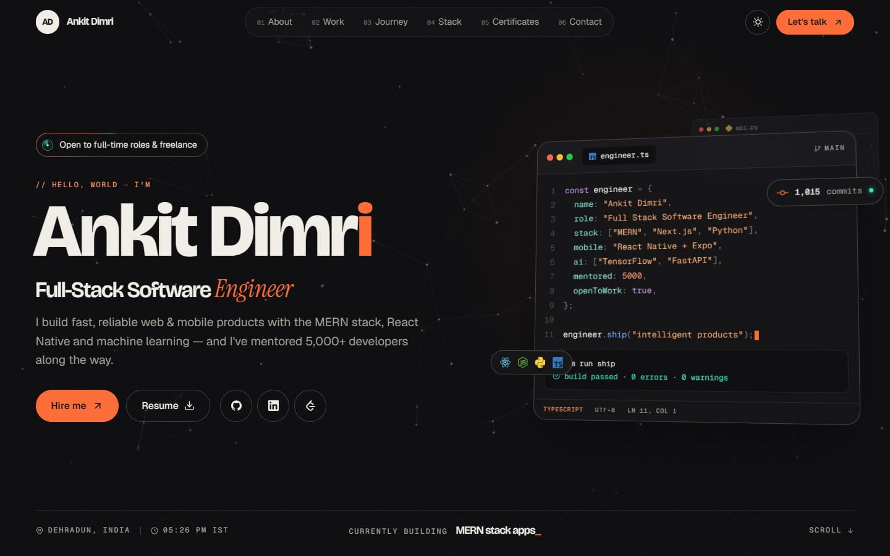](docs/screenshots/01-hero-dark.jpg)<br><sub>Hero · dark</sub> | [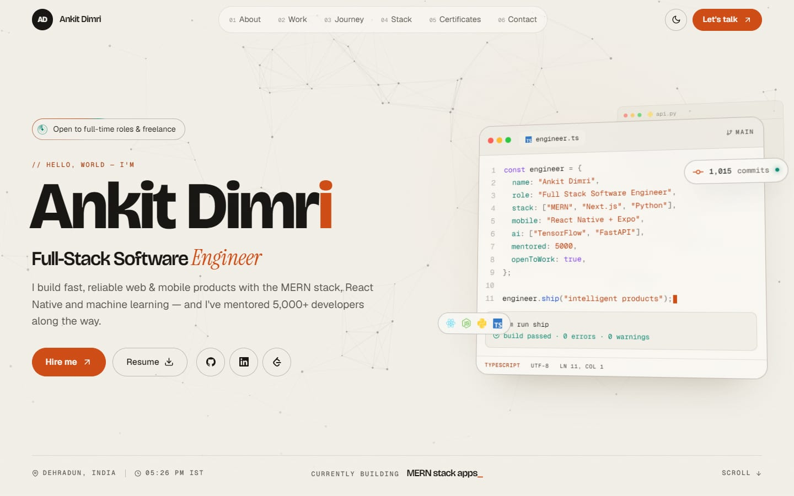](docs/screenshots/02-hero-light.jpg)<br><sub>Hero · light</sub> | [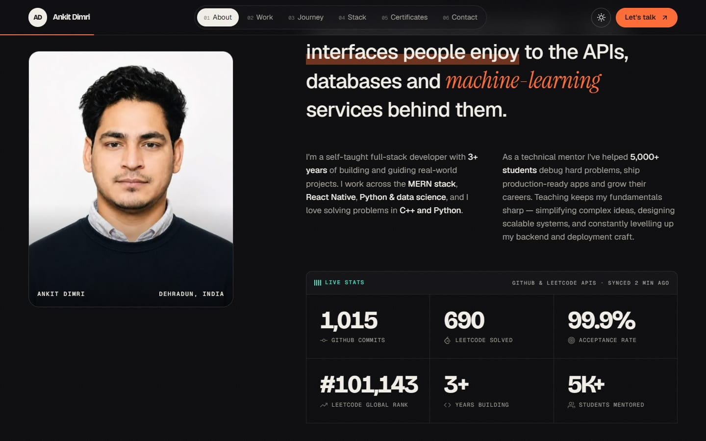](docs/screenshots/03-about-live-stats.jpg)<br><sub>About · live GitHub &amp; LeetCode stats</sub> |
| [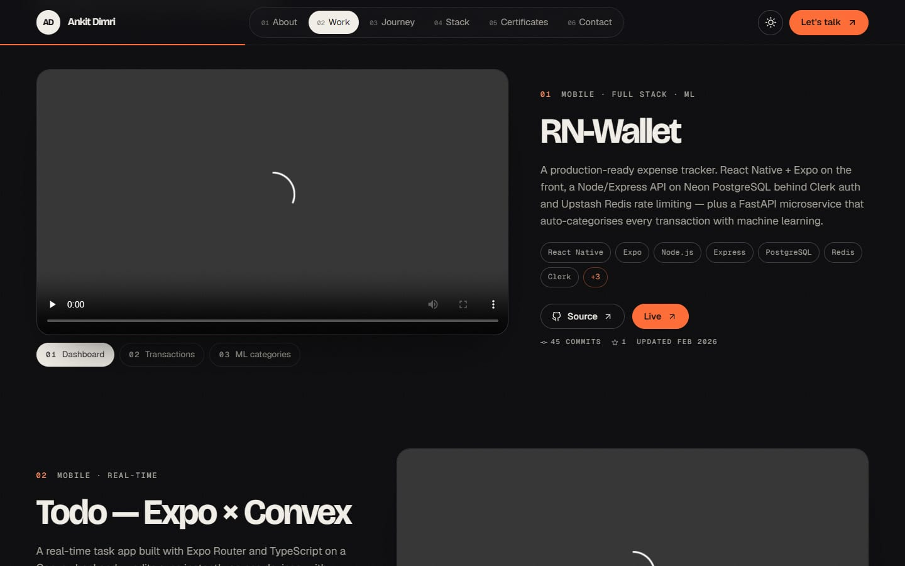](docs/screenshots/04-work.jpg)<br><sub>Selected work · demo videos</sub> | [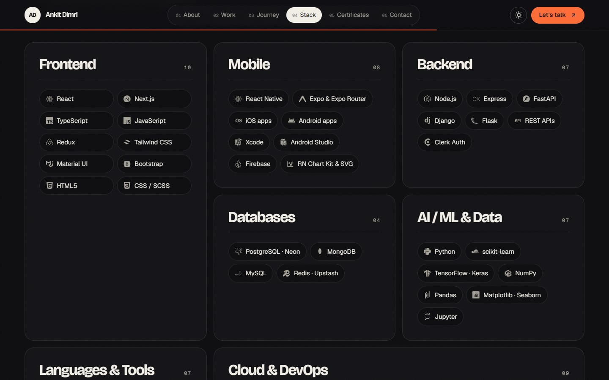](docs/screenshots/05-stack.jpg)<br><sub>Stack · bento grid</sub> | [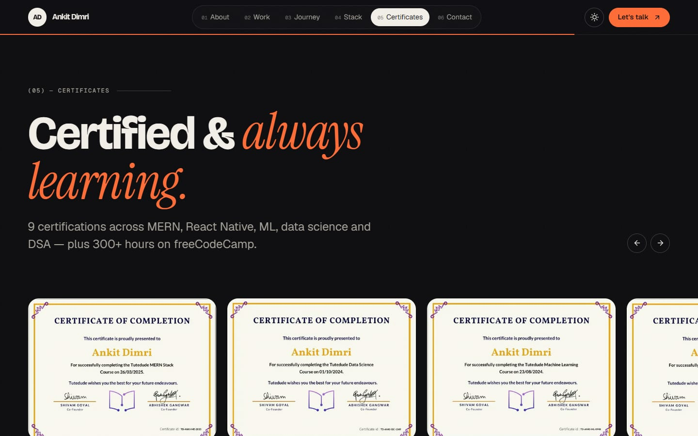](docs/screenshots/06-certificates.jpg)<br><sub>Certificates · cover-flow</sub> |
| [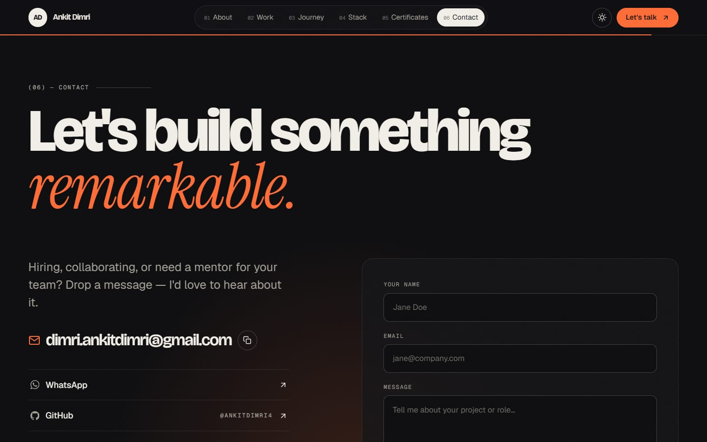](docs/screenshots/07-contact.jpg)<br><sub>Contact</sub> | [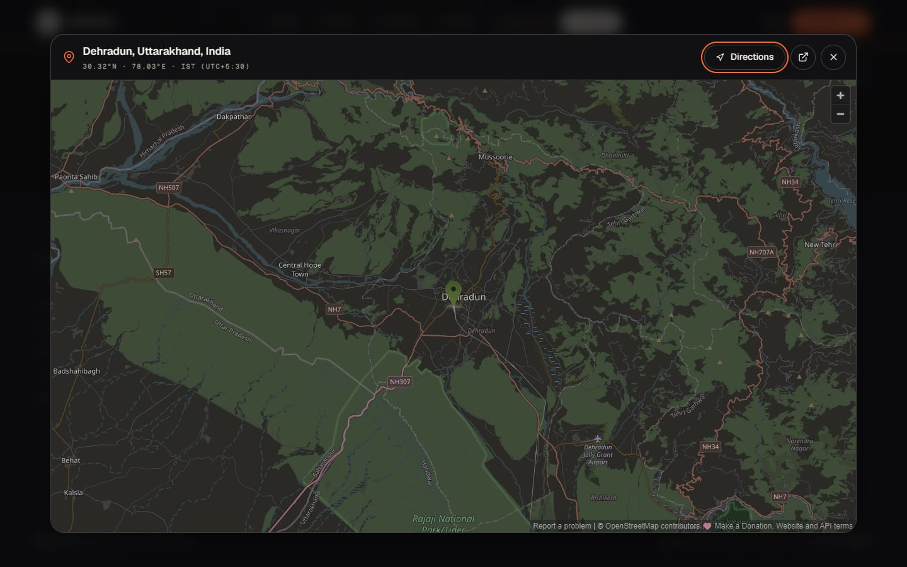](docs/screenshots/08-map-dialog.jpg)<br><sub>In-page full-screen map</sub> | [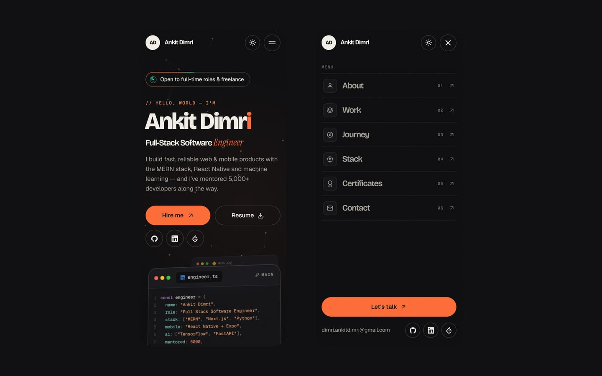](docs/screenshots/09-mobile.jpg)<br><sub>Mobile · hero &amp; menu</sub> |

---

## Previous design

<details>
<summary><b>See the previous version</b> — screen recording &amp; screenshots</summary>
<br>

<div align="center">
  <a href="docs/media/old-design.mp4" title="Play the recording of the previous design">
    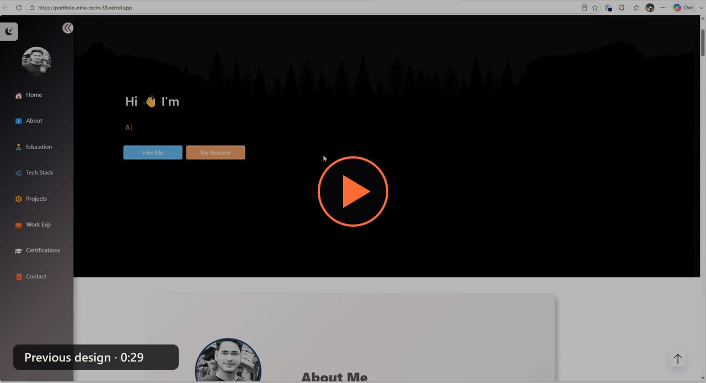
  </a>
  <br>
  <sub>▶ Click to play the 29-second recording (<code>docs/media/old-design.mp4</code>)</sub>
</div>
<br>

|  |  |  |
|---|---|---|
|  |  |  |
|  |  |  |

</details>

---

## Performance

Lighthouse on the production build, before → after the redesign:

| Metric | Previous design | New design |
|---|---|---|
| Performance (desktop / mobile) | 89 / 66 | **100 / ~90** |
| Accessibility | 76 | **100** |
| Best Practices | 96 | **100** |
| SEO | 92 | **100** |
| JavaScript (gzipped, initial) | 243 kB + jQuery/Bootstrap | **75 kB** (+33 kB icons, loaded on demand) |
| Total page weight | 1,918 kB · 50 requests | **~250 kB · 15 requests** |
| Largest Contentful Paint (mobile) | 6.4 s | **~2.9 s** |

---

## Tech Stack

| Frontend | Backend | Tooling &amp; hosting |
|---|---|---|
| React 18 (Create React App) | Node.js + Express | Vercel (frontend) |
| Hand-built CSS design system | PostgreSQL (Neon) via `pg` | Render (API) |
| CSS scroll-driven animations | SendGrid (email notifications) | GitHub &amp; LeetCode APIs |
| Canvas 2D (hero network) | In-memory caching &amp; rate limiting | Self-hosted fonts, WebP images |
| react-icons | dotenv, cors | Jest + Testing Library |

---

## Project Structure

```
Portfolio/
├── client/                      # React frontend (Vercel root directory)
│   ├── public/                  # index.html (SEO/meta), fonts, icons, og-image, sitemap, robots
│   ├── src/
│   │   ├── sections/            # Hero, About, Work, Journey, Stack, Certificates, Contact
│   │   ├── components/          # Nav, Footer (+ map dialog), CodeCard, Marquee, NeuralField, ScrambleText…
│   │   ├── data/profile.js      # ← all site content: profile, projects, journey, certificates
│   │   ├── lib/                 # API client (shared fetch cache), scroll-reveal helpers
│   │   ├── context/             # ThemeContext (dark / light, persisted)
│   │   ├── styles/              # global design tokens, scroll "unfold" animations
│   │   └── assets/              # resume PDF, optimised WebP images, certificates
│   ├── vercel.json              # security & caching headers
│   └── package.json
│
├── backend/                     # Node.js + Express API (Render root directory)
│   ├── controllers/             # contact form, GitHub stats, LeetCode stats
│   ├── middleware/rateLimit.js  # per-IP rate limiting
│   ├── routes/portfolioRoutes.js
│   ├── config/db.js             # PostgreSQL (Neon) pool
│   └── server.js                # security headers, CORS allow-list, JSON errors
│
├── docs/                        # README screenshots and the previous-design recording
└── README.md
```

> To update projects, experience or certificates, edit **`client/src/data/profile.js`** — no component changes needed.

---

## Environment Variables

### Frontend — `client/.env`

```env
REACT_APP_BACKEND_URL=https://portfolio-backend-71xj.onrender.com
```

⚠️ Every `REACT_APP_*` variable is compiled into the public JavaScript bundle. **Never put tokens or keys in the frontend** — GitHub data is fetched by the backend instead.

### Backend — `backend/.env`

```env
PORT=8080
DATABASE_URL=your_neon_postgres_url
SENDGRID_API_KEY=your_sendgrid_api_key
SENDGRID_SENDER_EMAIL=sender@example.com
SENDGRID_RECEIVER_EMAIL=receiver@example.com
# Strongly recommended: a GitHub token with NO scopes (public read only).
# Raises the API limit from 60 to 5,000 requests/hour; without it, shared hosting IPs can hit the limit.
GITHUB_TOKEN=your_github_token
# Recommended: comma-separated origins allowed to call the API
CORS_ORIGIN=https://portfolio-nine-orcin-33.vercel.app,http://localhost:3000
```

⚠️ **Do not commit `.env` files.** They are covered by `.gitignore`.

---

## Run Locally

**Backend**

```bash
cd backend
npm install
npm run dev        # http://localhost:8080  (npm start for production)
```

**Frontend**

```bash
cd client
npm install
npm start          # http://localhost:3000
```

To use the local API during development, create `client/.env.development.local` with `REACT_APP_BACKEND_URL=http://localhost:8080`.

```bash
npm test                  # client tests
CI=true npm run build     # production build — warnings fail the build, same as Vercel
```

---

## Deployment

**Backend → Render**
- Root directory: `backend` · Build: `npm install` · Start: `npm start`
- Set the backend environment variables above (including `GITHUB_TOKEN` and `CORS_ORIGIN`).

**Frontend → Vercel**
- Root directory: `client` · Framework preset: Create React App
- Environment variable: `REACT_APP_BACKEND_URL` = your Render URL
- `client/vercel.json` adds security headers (anti-clickjacking, `nosniff`, referrer &amp; permissions policies) and long-term caching for hashed assets.

---

## API

Base URL: `https://portfolio-backend-71xj.onrender.com/api/v1/portfolio`

### `POST /sendEmail` — contact form

```json
{ "name": "Ankit Dimri", "email": "dimri.ankitdimri@gmail.com", "msg": "Hello, I want to connect!" }
```

```json
{ "success": true, "message": "Message sent and saved successfully" }
```

Validation: all fields required, valid email (max 150 chars), name max 100 chars, message max 5,000 chars. Rate limited to 5 messages per 15 minutes per IP (`429` when exceeded). Visitor input is HTML-escaped in the notification email.

### `GET /github` — GitHub stats

Public repositories with commit counts, stars, language and last push, plus `totalCommits`. Fetched server-side and cached for 1 hour. If some counts can't be fetched (e.g. rate limiting), last known values are used; if a total can't be computed reliably, `totalCommits` is `null` and `partial` is `true` rather than returning an undercount.

### `GET /leetcode` — LeetCode stats

`totalSolved`, `acceptanceRate` and global `ranking`. Cached for 10 minutes.

Errors are always JSON (`{ "success": false, "message": "..." }`) and never include stack traces.

---

## Database

Contact messages are stored in the `contacts` table (PostgreSQL / Neon):

```sql
CREATE TABLE contacts (
  id SERIAL PRIMARY KEY,
  name VARCHAR(100),
  email VARCHAR(150),
  message TEXT,
  created_at TIMESTAMP DEFAULT CURRENT_TIMESTAMP
);
```

---

## Security

- No secrets in the frontend bundle or the repository; GitHub access is server-side only.
- JSON-only errors (no stack traces), `X-Powered-By` removed, `nosniff` / frame-deny / referrer headers, optional CORS allow-list.
- Contact form: validation, HTML escaping, 20 kB body limit, per-IP rate limiting; parameterised SQL.
- `npm audit`: 0 vulnerabilities in backend dependencies and in the frontend code shipped to visitors.

---

## Author

**Ankit Dimri** — Full-Stack Software Engineer · 📍 Dehradun, India

 [GitHub](https://github.com/AnkitDimri4) &nbsp;
 [LinkedIn](https://linkedin.com/in/ankit-dimri-a6ab98263) &nbsp;
 [LeetCode](https://leetcode.com/u/user4612MW/)

---

<div align="center">
  Created by <b>Ankit Dimri</b> · © 2024–2026 · MIT License
</div>
